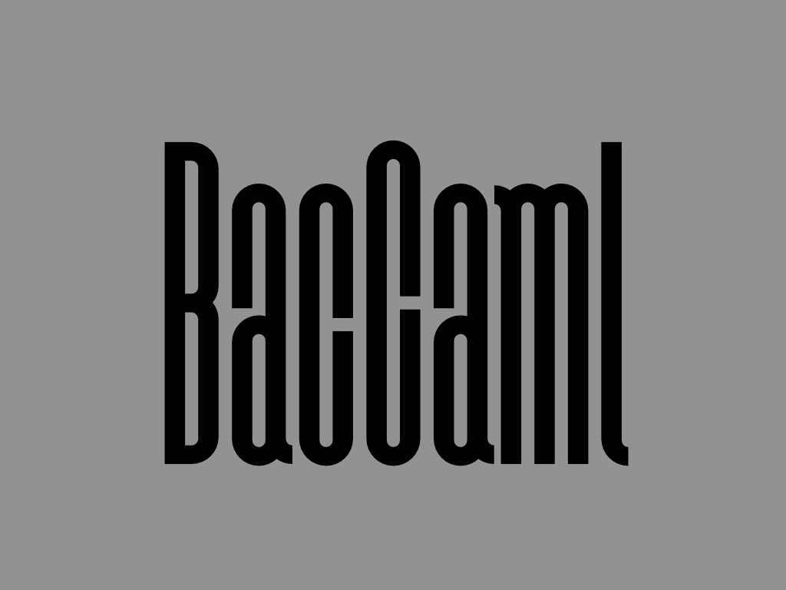

[](https://travis-ci.org/prg-titech/baccaml)

<div align=center>

</div>

---

<div style="text-align: center;">
This is an experimental meta-hybrid JIT compiler using both approach of method and tracing JIT.
This project is forked from <a href="https://github.com/esumii/min-caml">min-caml</a>, an educational mini ML compiler.
</div>

## BacCaml Project

- BacCaml: The Meta JIT Compiler
- RCaml: CLI interface
- Armin: interface language for BacCaml

### Setup

- Install dependencies:

  ```shell
  $ opam install core menhir ppx_deriving stringext logs fmt dune
  ```

- For your developing environment:

	```shell
	$ opam install tuareg merlin ocp-indent utop
	```

### Build and execute

```bash
$ make
$ dune exec [target].exe -- -file [filename] -red [red variables] -green [green variables] -code [bytecode] -o [output]
```
